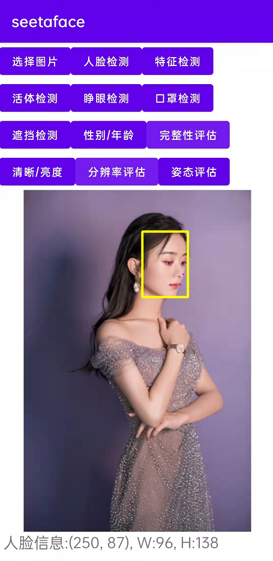

# seetaface6JNIToAPP

## 简介

官方的例子以及其他开发者提供的例子都是针对安卓工程师而言,最大的问题就是,文件出现一大堆,功能链接乱七八糟,很不友好.作为一个C++工程师,这是不能接受的,于是我的理念就是制作JNI,为什么不能像seetaface的电脑端那样的方式调用使用呢.根本的问题出在模型文件的地址问题.编写了一个函数,成功把这个问题解决了.另外把seetaface的功能调用进行了统一.

## 如果觉得对你有帮助,给个小星星支持一下吧^_^

